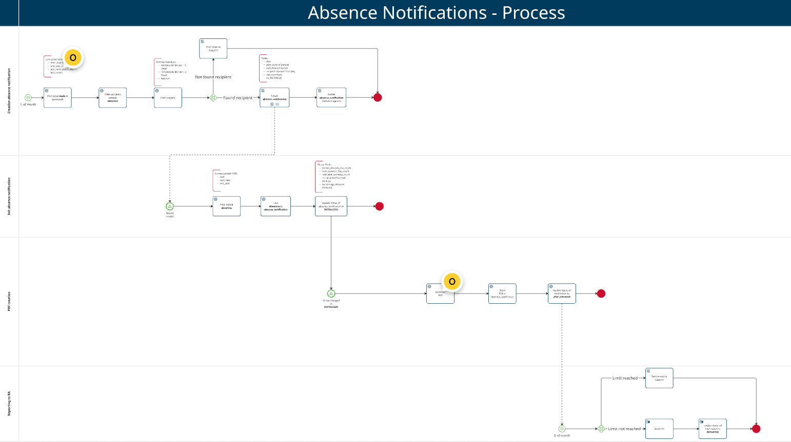
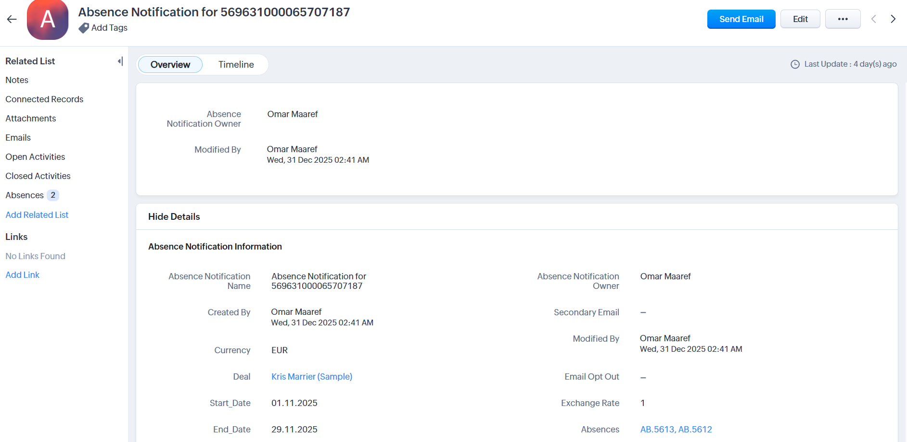

# Absence Notification API Integration

## Overview

In this project I implemented a CRM-integrated solution that automatically generates absence notifications on a monthly basis based on recorded absences.

It automates data retrieval from Zoho CRM, applies business logic to assemble **Absence Notifications** for each Deal, creates records within Zoho, and generates pre-filled **AcroForm PDFs** from a template.

## Features

- **Zoho CRM Integration (via internal microservice):** Reads and writes Zoho CRM data through an internal proxy service.
- **Absence Notification Workflow:** Identifies absences in a given period, groups by Deal, creates/updates `Absence_Notifications`, and links related `Absences`.
- **Modular & Extensible:** Structured as focused libraries and applications (connector, PDF editor, workflow service).

## Architecture & Components

- **Absence Notification Process**  
  (`absences-notification/notification-process`): NestJS service exposing an API endpoint to run the workflow.
- **Zoho Connector (internal)**  
  (`zoho/libs/connector`): Type-safe NestJS client that communicates with the internal Zoho proxy using `MS_ZOHO_URL`.
- **Zoho Service**  
  (`zoho/service`): NestJS-based microservice acting as a Zoho CRM proxy (handles OAuth, rate limits, CRUD, searching, attachments).
- **AcroForm PDF Editor**  
  (`absences-notification/libs/acroform-pdf-editor`): Library based on `pdf-lib` for populating Absence Notification PDF forms.

## CRM Workflow & Automation (Zoho)

- **Zoho Workflow Rule / Custom Function (Deluge):** Triggers the integration endpoint, typically scheduled monthly.

## Technologies Used

- **Node.js / NestJS**
- **TypeScript**
- **Zoho CRM API** (through internal `zoho-service`)
- **pdf-lib** (for AcroForm PDF manipulation)
- **Docker / Docker Compose** (for deploying services)

## Process Diagram

## Example Absence Notification PDF

An example of a generated Absence Notification record with 2 attached absences:

> **Note:** This codebase is a demonstration and not production-ready. It provides a subset of services and features to illustrate integration architecture and workflow. Real-world usage requires further development, configuration, and integration with live external systems.
